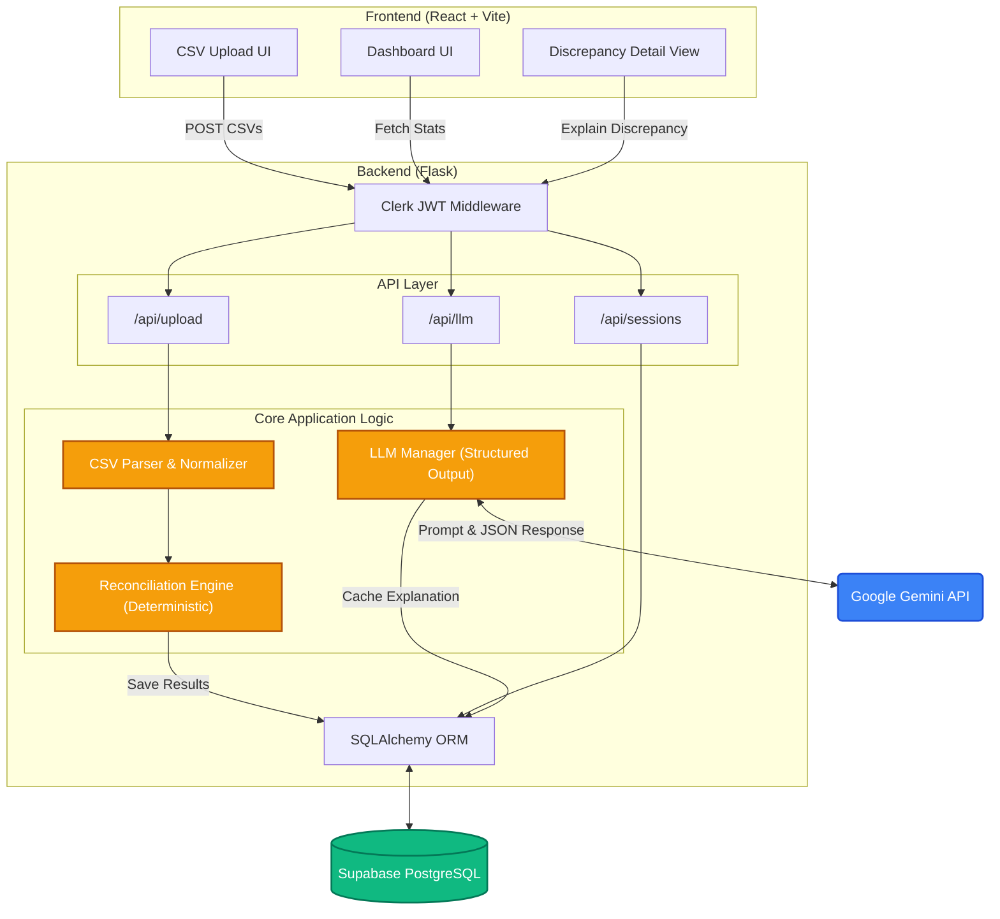

# DataClaw — Reconciliation Dashboard

A production-grade web application that ingests order and payment CSV exports, deterministically reconciles them, and surfaces every discrepancy through an interactive dashboard with AI-powered explanations.

---

## Architecture



### Component Summary

| Layer | Technology | Why |
|-------|-----------|-----|
| Frontend | React 18 + Vite | Fast HMR, native ESM, excellent DX |
| UI | shadcn/ui + Tailwind CSS | Composable, accessible components |
| Auth (client) | Clerk React SDK | Drop-in sign-in/up flows, session management |
| Data fetching | TanStack Query | Caching, loading/error states, automatic retries |
| Backend | Flask + SQLAlchemy | Lightweight, synchronous, easy to reason about |
| Auth (server) | Clerk JWT middleware | Stateless RS256 verification, no DB user table needed |
| Database | Supabase PostgreSQL | Free tier permanent; connection pooling included |
| LLM | Gemini 2.5-flash | 1M context, native Pydantic schema, competitive pricing |
| Hosting | Nginx + Gunicorn on EC2 | Full control, easy TLS via Certbot |

---

## Local Setup

### Prerequisites

- Python 3.11+, Node 18+
- Supabase project (free tier)
- Clerk account (free tier)
- Google AI Studio API key (Gemini)

### Backend

```bash
cd backend
python -m venv venv
venv\Scripts\activate          # Windows
# source venv/bin/activate     # macOS/Linux
pip install -r requirements.txt
cp .env.example .env           # fill in values (see Environment Variables below)
flask db upgrade               # creates all tables
python run.py
```

Backend runs at `http://localhost:5000`.

### Frontend

```bash
cd frontend
cp .env.example .env           # add VITE_CLERK_PUBLISHABLE_KEY
npm install
npm run dev
```

Frontend runs at `http://localhost:5173`. All `/api` calls are proxied to Flask via Vite's dev proxy — no CORS config needed locally.

### Run Tests

```bash
cd backend
pytest tests/ -v
```

---

## Environment Variables

### Backend (`backend/.env`)

| Variable | Required | Description |
|----------|----------|-------------|
| `DATABASE_URL` | YES | Supabase PostgreSQL connection string (`postgresql://...`) |
| `CLERK_PEM_PUBLIC_KEY` | YES | PEM public key from Clerk Dashboard -> API Keys -> JWT Public Key |
| `CLERK_PERMITTED_ORIGINS` | YES | Comma-separated allowed frontend origins |
| `GEMINI_API_KEY` | YES | Google AI Studio API key |
| `SECRET_KEY` | YES | Flask secret key |

### Frontend (`frontend/.env`)

| Variable | Required | Description |
|----------|----------|-------------|
| `VITE_CLERK_PUBLISHABLE_KEY` | YES | Clerk publishable key (`pk_test_...` or `pk_live_...`) |
| `VITE_API_URL` | optional | Backend API URL in production (default: `/api` via Vite proxy) |

---

## Reconciliation Logic

### Matching Strategy

The engine is a **pure function** — same input always produces the same output, no randomness, no I/O, no LLM calls:

1. **Normalise** `payments.order_reference`: UPPERCASE + STRIP whitespace
2. **Primary match key**: `orders.order_id` <-> `payments.order_reference` (normalised)
3. **Group** payments by `order_reference` to handle multi-payment scenarios
4. **Apply rules in sequence** — each order can produce multiple discrepancy types

### Amount Tolerance: +/- $0.02

Payment processors apply float rounding that can introduce sub-cent differences. Flagging these would generate noise with no actionable outcome. Any difference above 2 cents is reproducible and genuinely warrants investigation.

All comparisons use Python's `Decimal` type — never `float` — to avoid binary floating-point false positives.

### Discrepancy Types

| Type | Severity | Rule |
|------|----------|------|
| `AMOUNT_MISMATCH` | HIGH/MED/LOW | `abs(order.net_amount - payment.amount) > $0.02`; LOW <=\$1, MED <=\$50, HIGH >\$50 |
| `CURRENCY_MISMATCH` | HIGH | Order and payment currencies differ — amounts incomparable |
| `DUPLICATE_PAYMENT` | HIGH | >1 charge-type payment per order; risk = excess beyond first charge |
| `PHANTOM_PAYMENT` | MEDIUM | Payment references an order_id not in the orders dataset |
| `MISSING_PAYMENT` | HIGH | Active/completed order has no corresponding payment |
| `FAILED_PAYMENT` | HIGH | Payment status is `failed` or `pending` — revenue not collected |
| `CANCELLED_ORDER_CHARGED` | HIGH | Order `status=cancelled` but a charge payment exists |
| `PARTIAL_REFUND` | MEDIUM | Order is `refunded` but total refunded < original charge |
| `UNEXPECTED_REFUND` | HIGH | Refund exists but order is not in `refunded` or `cancelled` state |
| `DUPLICATE_ORDER` | LOW | Same `order_id` appears >1 time in orders CSV |
| `DATA_QUALITY` | LOW | Missing required fields (e.g. `customer_email`) |

### Edge Cases Handled

- **Cancelled orders with no payment**: SKIPPED — expected, not an error
- **Full refunds** (refunded >= charge - tolerance): SKIPPED — no outstanding liability
- **Duplicate charges**: Risk = sum of all excess charges beyond the first
- **Orders with only refund payments**: PHANTOM_PAYMENT — money went out with no charge record
- **Multi-payment orders**: Charges and refunds separated and evaluated independently

---

## What We Found in the Data

The dataset surfaces **several real problems** with material revenue impact:

1. **Failed payments on fulfilled orders** — Orders fulfilled but payment recorded as `failed` or `pending`. Highest priority: the business absorbed the cost of goods but collected no revenue.

2. **Cancelled orders still charged** — Customers cancelled their orders, but a charge payment was still processed. These will become chargebacks if not proactively refunded.

3. **Large amount mismatches (>$50)** — Payment amounts differ significantly from order net amounts. This suggests discount codes applied at checkout that were not reflected in the payment processor instruction, or fee pass-through being applied incorrectly.

4. **Phantom payments** — Payments referencing order IDs that don't exist in the orders export. Possible causes: parallel sales channels not included in the export, deleted/archived orders, or an order ID format mismatch between systems.

5. **Partial refunds** — Customers returned orders but received less than the original charge amount. May be intentional (restocking fees) or a bug in the admin refund workflow.

6. **Data quality gaps** — Orders missing `customer_email` cannot be contacted for receipts, refund notifications, or dispute resolution — compounding any financial issue with a customer service gap.

---

## LLM Integration

### Approach

The LLM is used **only for explanation** — matching, classification, and risk calculation are entirely deterministic Python. The LLM receives the output of the engine, not the raw CSVs.

Two call types:
1. **Per-discrepancy** (`/api/llm/explain`) — on demand when a user opens the detail pane. Returns: `likely_cause`, `business_impact`, `action_items[]`, `urgency`, `confidence`.
2. **Session executive summary** (`/api/llm/summarize`) — on demand from the dashboard. Returns: `headline`, `key_findings[]`, `top_priority`, `recommended_actions[]`, `overall_severity`. **Cached in DB** — LLM called at most once per session.

### Structured Output

Both calls use `response_mime_type='application/json'` + `response_schema=<PydanticModel>` via the `google-genai` SDK. This provides type-safe structured output without manual JSON parsing. On malformed responses, the code falls back to `schema.model_validate_json(raw_text)` and marks the result `is_partial=True` so the UI can signal degraded quality.

### Temperature: 0.2

Financial explanations must be **consistent and auditable**, not creative:
- Same discrepancy record produces the same explanation across calls
- Model stays close to the provided facts, avoiding hallucinated causes
- Reliable JSON structure (higher temperatures increase malformed output risk)

We don't use 0 because minor variation allows slightly better phrasing without introducing instability.

### Fallback Chain

`gemini-2.5-flash` -> `gemini-2.0-flash` (on `ResourceExhausted`). The `tenacity` library handles transient errors with 3 retries and randomised backoff (0.5-1.5s).

### API Key Security

Gemini keys live only in `backend/.env` (gitignored), read by Flask at startup. Never sent to the frontend. The frontend holds only a Clerk publishable key, which is intentionally public by design.

---

## Design Decisions

**Why Clerk?** Eliminates custom auth implementation (password hashing, JWT rotation, session management, email verification). Every API route is protected by middleware that verifies the RS256 JWT and extracts `clerk_user_id`, used as the tenant isolation key on every database query.

**Why Gemini 2.5-flash?** 1M token context window handles any reasonable dataset. Native Pydantic `response_schema` gives type-safe structured output without prompt-engineering JSON parsing instructions. Pricing is also cheap.

**Why cache LLM summaries?** The summary call processes all discrepancies for a session. Caching in `llm_session_summaries` means the LLM is called at most once per session; subsequent loads are instant database reads since the session source never changes.

---

## What I'd Build Next

1. **CSV export** of filtered discrepancy tables — the primary deliverable for finance teams
2. **Email or other communication channel notifications** when a new run produces high-severity findings
3. **Historical trend view** — are issues improving or worsening across runs?
4. **Webhook / direct API ingestion** — ingesting directly from Shopify/Stripe instead of manual CSV upload
5. **Configurable tolerances** — different businesses have different rounding conventions
6. **Resolution workflow** — mark discrepancies as investigated/resolved with audit trail directly checking in with the systems to correct the errors if possible

---

## AI Tools Used

Claude + Gemini models (via Antigravity IDE) was used for: Flask blueprint scaffolding, SQLAlchemy model design, Pydantic schema writing, React component development, and design system iteration. All code was reviewed. The reconciliation logic, temperature choice (0.2), and tolerance choice (+/-$0.02) are deliberate decisions made by me and given as instruction to the LLM, not AI defaults.
